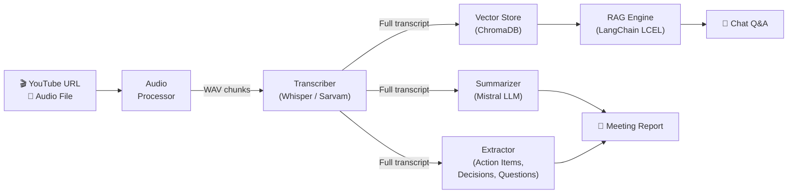

<div align="center">

#  AI Meeting Assistant

**Transform any meeting recording into actionable insights in minutes.**

Paste a YouTube link or upload an audio file — get a professional summary, action items, key decisions, and chat with your meeting using RAG-powered Q&A.

[](https://python.org)
[](https://streamlit.io)
[](https://langchain.com)
[](https://mistral.ai)

</div>

---

## ✨ Features

| Feature | Description |
|---|---|
| **Dual Transcription** | OpenAI Whisper (English) + Sarvam AI (Hinglish — Hindi+English) |
| **Smart Summarization** | Map-reduce summaries via Mistral LLM with LangChain LCEL |
| **Action Item Extraction** | Tasks, owners, and deadlines pulled from the transcript |
| **Key Decisions** | Important decisions identified and listed |
| **Open Questions** | Unresolved questions surfaced for follow-up |
| **RAG-Powered Chat** | Ask questions about the meeting — answers grounded in the transcript |
| **PDF & TXT Export** | Download professional meeting reports |
| **Polished UI** | Dark-themed Streamlit app with custom CSS |

---

##  Architecture



---

##  Tech Stack

- **Speech-to-Text**: [OpenAI Whisper](https://github.com/openai/whisper) (local) + [Sarvam AI](https://sarvam.ai) (Hinglish)
- **LLM**: [Mistral AI](https://mistral.ai) via LangChain
- **Orchestration**: [LangChain](https://langchain.com) (LCEL chains)
- **Embeddings**: [Sentence Transformers](https://www.sbert.net/) (`all-MiniLM-L6-v2`)
- **Vector DB**: [ChromaDB](https://www.trychroma.com/)
- **Audio**: [yt-dlp](https://github.com/yt-dlp/yt-dlp) + [pydub](https://github.com/jiaaro/pydub) + FFmpeg
- **UI**: [Streamlit](https://streamlit.io)
- **PDF Export**: [fpdf2](https://py-pdf.github.io/fpdf2/)

---

## Quick Start

### Prerequisites

- Python ≥ 3.10
- [FFmpeg](https://ffmpeg.org/download.html) installed and on PATH
- [Mistral AI API key](https://console.mistral.ai/) (free tier available)

### Installation

```bash
# Clone the repository
git clone https://github.com/YOUR_USERNAME/ai-meeting-assistant.git
cd ai-meeting-assistant

# Create virtual environment
python -m venv .venv
source .venv/bin/activate   # macOS/Linux
# .venv\Scripts\activate    # Windows

# Install dependencies
pip install -r requirements.txt
```

### Configuration

```bash
# Copy the example env file and add your keys
cp .env.example .env
```

Edit `.env` and add your API key:
```
MISTRAL_API_KEY=your_key_here
```

### Run

```bash
streamlit run app.py
```

The app opens at **http://localhost:8501**.

---

## 📁 Project Structure

```
ai-meeting-assistant/
├── app.py                  # Streamlit UI (main entry point)
├── core/
│   ├── transcriber.py      # Whisper + Sarvam AI transcription
│   ├── summarizer.py       # Map-reduce summarization (Mistral)
│   ├── extractor.py        # Action items, decisions, questions
│   ├── rag_engine.py       # RAG pipeline (LangChain LCEL)
│   └── vector_store.py     # ChromaDB vector store
├── utils/
│   ├── audio_processor.py  # YouTube download, WAV conversion, chunking
│   └── export.py           # PDF & TXT report generation
├── .streamlit/
│   └── config.toml         # Streamlit theme configuration
├── requirements.txt
├── .env.example
└── README.md
```

---

##  Usage

1. **Paste a YouTube URL** or **upload an audio/video file** (MP3, MP4, WAV, M4A, WebM)
2. Select the **language** (English or Hinglish)
3. Click **🚀 Process Meeting**
4. Explore results across tabs: Summary, Action Items, Decisions, Questions
5. **Chat** with the AI about the meeting content
6. **Download** a PDF or TXT report

---

##  Environment Variables

| Variable | Required | Description |
|---|---|---|
| `MISTRAL_API_KEY` | ✅ | Mistral AI API key for summarization & extraction |
| `SARVAM_API_KEY` | Optional | Sarvam AI key for Hinglish transcription |
| `WHISPER_MODEL` | Optional | Whisper model size (`tiny`, `base`, `small`, `medium`, `large`). Default: `small` |

---

##  Docker

### Quick Start (Local)

```bash
# Build and run with Docker Compose
docker compose up --build

# Access the app at http://localhost:8501

# Run in background (detached mode)
docker compose up -d --build

# View logs
docker compose logs -f

# Stop
docker compose down
```

### Environment Variables

Create a `.env` file (see `.env.example`):

```bash
cp .env.example .env
# Edit .env and set your MISTRAL_API_KEY
```

---

##  AWS Deployment (24/7)

Deploy to an EC2 instance running Docker for always-on operation.

### Prerequisites

1. [AWS CLI](https://docs.aws.amazon.com/cli/latest/userguide/getting-started-install.html) installed
2. AWS credentials configured (`aws configure`)
3. Your Mistral API key in `.env`

### Step 1 — Provision EC2 Instance

```bash
chmod +x deploy/aws-setup.sh
./deploy/aws-setup.sh
```

This creates:
- A `t3.large` EC2 instance (2 vCPU, 8GB RAM)
- Security group with ports 22 (SSH) and 8501 (Streamlit) open
- SSH key pair saved to `~/.ssh/ai-meeting-assistant-key.pem`
- Docker + Docker Compose installed via user-data script

### Step 2 — Deploy the App

```bash
# Wait ~2 minutes for EC2 user-data to finish, then:
chmod +x deploy/deploy.sh
./deploy/deploy.sh
```

This uploads your code, builds the Docker image on EC2, and starts the container.

### Step 3 — Access

Open `http://<EC2_PUBLIC_IP>:8501` in your browser.

### Management Commands

```bash
# SSH into the instance
ssh -i ~/.ssh/ai-meeting-assistant-key.pem ec2-user@<EC2_IP>

# View container logs
docker compose logs -f

# Restart the app
docker compose restart

# Update and redeploy
./deploy/deploy.sh <EC2_IP>

# Stop the app
docker compose down
```

### 24/7 Operation

The container is configured with `restart: unless-stopped`, which means:
-  Auto-restarts on application crash
-  Auto-restarts after Docker daemon restart
-  Auto-restarts after EC2 reboot
-  Only stops when you explicitly run `docker compose down`

### Cost Estimate

| Instance | Specs | Monthly Cost |
|---|---|---|
| `t3.medium` | 2 vCPU, 4GB RAM | ~$30/month |
| `t3.large` (recommended) | 2 vCPU, 8GB RAM | ~$60/month |
| `t3.xlarge` | 4 vCPU, 16GB RAM | ~$120/month |

---

##  License

This project is for educational and portfolio purposes.

---

<div align="center">
<sub>Built with  using Python, Whisper, Mistral AI, LangChain, ChromaDB & Streamlit</sub>
</div>
